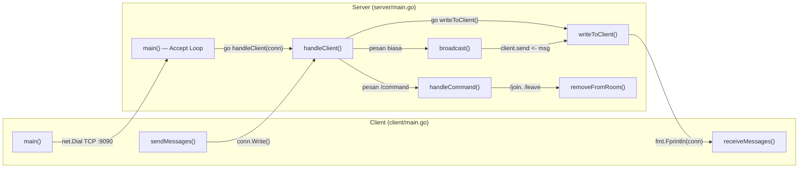
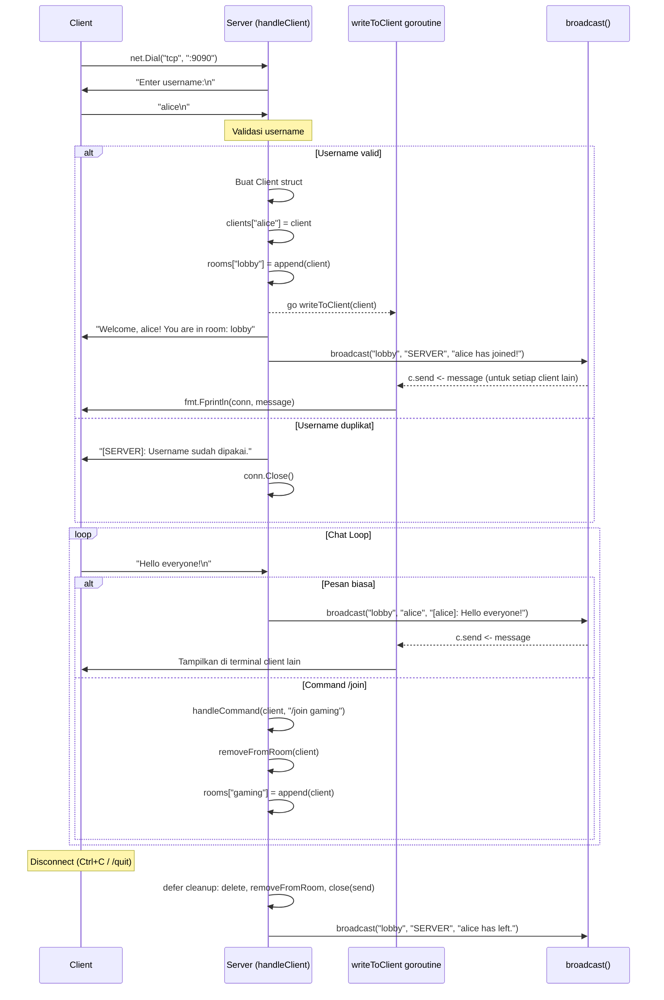
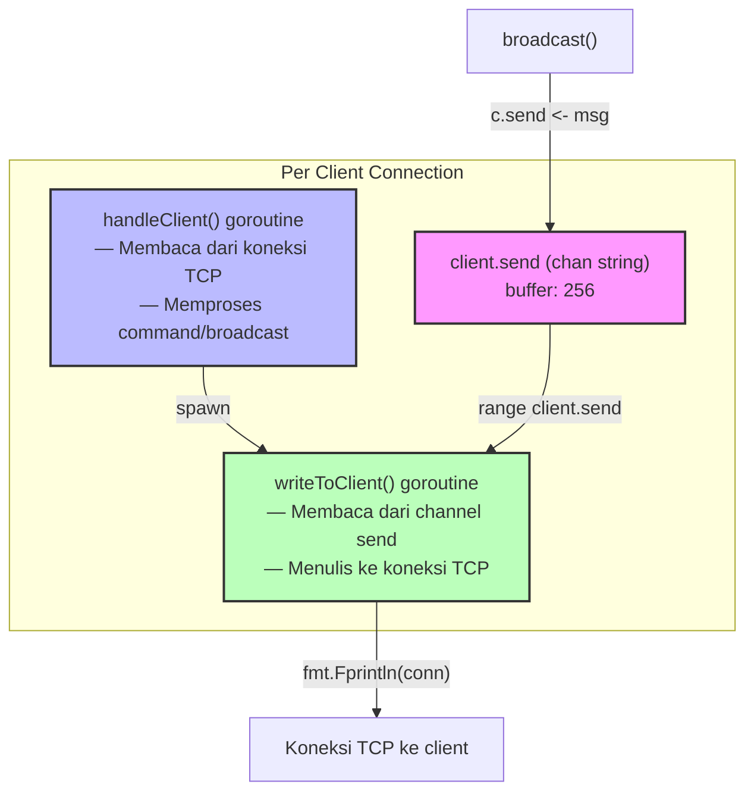

# 📖 Rangkuman Lengkap Kode — Go Chat Application

> **Module:** `chatapp` | **Go Version:** 1.25.4  
> **Library:** Hanya standard library (`net`, `bufio`, `fmt`, `os`, `strings`, `sync`)

---

## Daftar Isi

- [Arsitektur Umum](#arsitektur-umum)
- [Server — `server/main.go`](#server--servermaingoserver)
  - [Import & Package](#1-import--package)
  - [Struct `Client`](#2-struct-client)
  - [Variabel Global (State Server)](#3-variabel-global-state-server)
  - [Fungsi `main()`](#4-fungsi-main)
  - [Fungsi `handleClient(conn net.Conn)`](#5-fungsi-handleclientconn-netconn)
  - [Fungsi `writeToClient(client *Client)`](#6-fungsi-writetoclientclient-client)
  - [Fungsi `broadcast(room, sender, message string)`](#7-fungsi-broadcastroom-sender-message-string)
  - [Fungsi `handleCommand(client *Client, cmd string)`](#8-fungsi-handlecommandclient-client-cmd-string)
  - [Fungsi `removeFromRoom(client *Client)`](#9-fungsi-removefromroomclient-client)
- [Client — `client/main.go`](#client--clientmaingoclient)
  - [Import & Package](#1-import--package-1)
  - [Fungsi `main()`](#2-fungsi-main-1)
  - [Fungsi `receiveMessages(conn net.Conn, reader *bufio.Reader)`](#3-fungsi-receivemessagesconn-netconn-reader-bufioreader)
  - [Fungsi `sendMessages(conn net.Conn)`](#4-fungsi-sendmessagesconn-netconn)
- [Ringkasan Error Handling](#ringkasan-error-handling)
- [Diagram Alur Kerja](#diagram-alur-kerja)

---

## Arsitektur Umum



Proyek ini adalah **aplikasi chat TCP client-server** dengan arsitektur:

| Komponen | File | Deskripsi |
|----------|------|-----------|
| **Server** | [server/main.go](file:///c:/Users/Lenovo/OneDrive%20-%20Universitas%20Katolik%20Parahyangan/Drive%20Kuliah/proggo/TUBES/server/main.go) | Menerima banyak koneksi TCP, mengelola room, broadcast pesan |
| **Client** | [client/main.go](file:///c:/Users/Lenovo/OneDrive%20-%20Universitas%20Katolik%20Parahyangan/Drive%20Kuliah/proggo/TUBES/client/main.go) | Terhubung ke server, mengirim & menerima pesan secara concurrent |

---

## Server — [server/main.go](file:///c:/Users/Lenovo/OneDrive%20-%20Universitas%20Katolik%20Parahyangan/Drive%20Kuliah/proggo/TUBES/server/main.go) {#server}

### 1. Import & Package

```go
package main

import (
    "bufio"   // Buffered I/O — membaca pesan per baris (ReadString('\n'))
    "fmt"     // Formatted I/O — menulis pesan ke koneksi dan terminal
    "net"     // Networking — TCP listener dan koneksi
    "os"      // OS — akses stderr untuk error fatal
    "strings" // String utility — TrimSpace, HasPrefix, Fields, Join
    "sync"    // Synchronization — RWMutex untuk proteksi data concurrent
)
```

> [!NOTE]
> Seluruh proyek hanya menggunakan **standard library Go** tanpa dependency eksternal.

---

### 2. Struct `Client`

```go
type Client struct {
    conn     net.Conn    // koneksi TCP
    username string      // identitas unik pengguna
    room     string      // room aktif saat ini, default "lobby"
    send     chan string  // channel buffered untuk antrian pesan keluar
}
```

**Penjelasan setiap field:**

| Field | Tipe | Fungsi |
|-------|------|--------|
| `conn` | `net.Conn` | Koneksi TCP aktif ke client. Digunakan oleh `writeToClient()` untuk mengirim pesan dan oleh `handleClient()` untuk membaca pesan masuk. |
| `username` | `string` | Nama unik yang diinput saat registrasi. Digunakan sebagai key di map `clients` dan untuk identifikasi pengirim pada broadcast. |
| `room` | `string` | Nama room tempat client berada saat ini. Default `"lobby"`. Berubah saat `/join`. Menentukan scope broadcast pesan. |
| `send` | `chan string` | Channel buffered (kapasitas 256) yang menjadi antrian pesan keluar. `broadcast()` menulis ke channel ini, `writeToClient()` membacanya. Memisahkan goroutine pembaca dan penulis agar tidak terjadi *interleaved write*. |

> [!IMPORTANT]
> Channel `send` berkapasitas **256 pesan**. Jika client terlalu lambat dan buffer penuh, pesan akan di-*skip* (non-blocking send via `select/default`).

---

### 3. Variabel Global (State Server)

```go
var (
    clients = make(map[string]*Client)   // key: username
    rooms   = make(map[string][]*Client) // key: nama room
    mu      sync.RWMutex                 // proteksi akses concurrrent
)
```

| Variabel | Tipe | Fungsi |
|----------|------|--------|
| `clients` | `map[string]*Client` | Menyimpan semua client yang terhubung dengan key berupa username. Digunakan untuk cek duplikasi username dan cleanup saat disconnect. |
| `rooms` | `map[string][]*Client` | Menyimpan daftar client per room. Key adalah nama room, value adalah slice pointer `*Client`. Digunakan oleh `broadcast()` untuk mengirim pesan hanya ke client di room yang sama. |
| `mu` | `sync.RWMutex` | Mutex **read-write** untuk proteksi akses concurrent ke `clients` dan `rooms`. `RLock` digunakan saat baca (broadcast, list rooms), `Lock` digunakan saat tulis (registrasi, join, leave, disconnect). |

> [!WARNING]
> **Semua akses ke `clients` dan `rooms` HARUS dilindungi `mu`** karena banyak goroutine berjalan bersamaan. Tanpa mutex, akan terjadi *data race*.

---

### 4. Fungsi `main()`

**Lokasi:** [server/main.go:28-51](file:///c:/Users/Lenovo/OneDrive%20-%20Universitas%20Katolik%20Parahyangan/Drive%20Kuliah/proggo/TUBES/server/main.go#L28-L51)

```go
func main() {
    ln, err := net.Listen("tcp", ":9090")
    // ...
    rooms["lobby"] = []*Client{}
    for {
        conn, err := ln.Accept()
        // ...
        go handleClient(conn)
    }
}
```

**Langkah-langkah:**

1. **Membuat TCP Listener** di port `9090` menggunakan `net.Listen("tcp", ":9090")`
2. **Inisialisasi room default** `"lobby"` sebagai slice kosong
3. **Loop tak terbatas** memanggil `ln.Accept()` untuk menerima koneksi baru
4. **Spawn goroutine** `go handleClient(conn)` untuk setiap koneksi baru

**Error Handling:**

| Kondisi Error | Penanganan |
|---------------|------------|
| `net.Listen()` gagal (misal: port sudah dipakai) | Print ke `stderr` → `os.Exit(1)` (**fatal, server berhenti**) |
| `ln.Accept()` gagal (misal: koneksi terputus saat handshake) | Print ke `stderr` → `continue` (**server tetap jalan, skip koneksi gagal**) |

---

### 5. Fungsi `handleClient(conn net.Conn)`

**Lokasi:** [server/main.go:55-143](file:///c:/Users/Lenovo/OneDrive%20-%20Universitas%20Katolik%20Parahyangan/Drive%20Kuliah/proggo/TUBES/server/main.go#L55-L143)

Ini adalah **goroutine utama per client**. Bertanggung jawab atas seluruh lifecycle satu koneksi: registrasi → chat loop → cleanup.

#### Fase 1: Registrasi Username (Baris 58-93)

```go
fmt.Fprint(conn, "Enter username:\n")
username, err := reader.ReadString('\n')
username = strings.TrimSpace(username)
```

1. Kirim prompt `"Enter username:"` ke client
2. Baca input username dari koneksi TCP
3. Trim whitespace (termasuk `\n` dan `\r`)
4. Validasi: username tidak boleh kosong
5. Cek uniqueness: apakah username sudah dipakai di map `clients`
6. Buat objek `Client` baru dengan room default `"lobby"`
7. Daftarkan ke map `clients` dan `rooms["lobby"]`
8. Jalankan goroutine `writeToClient(client)`
9. Kirim pesan welcome dan broadcast notifikasi join

**Error Handling pada Registrasi:**

| Kondisi Error | Penanganan |
|---------------|------------|
| `ReadString()` gagal (koneksi terputus saat input username) | `conn.Close()` → `return` (goroutine selesai) |
| Username kosong (`""`) | Kirim pesan error → `conn.Close()` → `return` |
| Username sudah dipakai | `mu.Unlock()` → kirim pesan error → `conn.Close()` → `return` |

> [!CAUTION]
> Perhatikan urutan `mu.Unlock()` sebelum `conn.Close()` saat username duplikat. Jika `Unlock` dilupa, akan terjadi **deadlock** karena goroutine lain tidak bisa mengakses map.

#### Fase 2: Defer Cleanup (Baris 105-118)

```go
defer func() {
    oldRoom := client.room
    mu.Lock()
    delete(clients, username)
    removeFromRoom(client)
    close(client.send)
    mu.Unlock()
    conn.Close()
    broadcast(oldRoom, "SERVER", ...)
}()
```

Block `defer` ini dijalankan **otomatis** saat fungsi `handleClient` selesai (baik normal maupun karena error). Langkah-langkah:

1. Simpan nama room terakhir (`oldRoom`)
2. Lock mutex
3. Hapus client dari map `clients`
4. Hapus client dari room via `removeFromRoom()`
5. Tutup channel `send` → sinyal ke `writeToClient()` untuk berhenti
6. Unlock mutex
7. Tutup koneksi TCP
8. Broadcast notifikasi bahwa user telah pergi

#### Fase 3: Loop Baca Pesan (Baris 121-142)

```go
for {
    message, err := reader.ReadString('\n')
    if err != nil {
        break // trigger defer cleanup
    }
    message = strings.TrimSpace(message)
    if message == "" { continue }

    if strings.HasPrefix(message, "/") {
        handleCommand(client, message)
    } else {
        broadcast(client.room, client.username, ...)
    }
}
```

- Membaca pesan baris per baris dari koneksi TCP
- Jika error/EOF → `break` → trigger `defer` cleanup
- Pesan kosong di-skip
- Pesan diawali `/` → dianggap command, diteruskan ke `handleCommand()`
- Pesan biasa → di-broadcast ke seluruh room

**Error Handling:**

| Kondisi Error | Penanganan |
|---------------|------------|
| `ReadString()` mengembalikan error (EOF, koneksi terputus, timeout) | `break` dari loop → `defer` cleanup otomatis berjalan |

---

### 6. Fungsi `writeToClient(client *Client)`

**Lokasi:** [server/main.go:148-156](file:///c:/Users/Lenovo/OneDrive%20-%20Universitas%20Katolik%20Parahyangan/Drive%20Kuliah/proggo/TUBES/server/main.go#L148-L156)

```go
func writeToClient(client *Client) {
    for msg := range client.send {
        _, err := fmt.Fprintln(client.conn, msg)
        if err != nil {
            break
        }
    }
}
```

**Peran:** Goroutine **penulis eksklusif** ke koneksi TCP client. Ini adalah satu-satunya goroutine yang boleh menulis ke `client.conn`.

**Mekanisme:**
- `for msg := range client.send` — membaca pesan dari channel secara blocking
- Saat channel ditutup (`close(client.send)` di defer), loop `range` otomatis berhenti
- Menulis setiap pesan ke koneksi TCP menggunakan `fmt.Fprintln`

**Error Handling:**

| Kondisi Error | Penanganan |
|---------------|------------|
| `fmt.Fprintln()` gagal (koneksi terputus saat menulis) | `break` dari loop → goroutine selesai |
| Channel `client.send` ditutup | `range` otomatis keluar → goroutine selesai |

> [!TIP]
> Pola **"single writer goroutine"** ini mencegah *interleaved write* yang bisa terjadi jika banyak goroutine menulis ke satu koneksi TCP secara bersamaan.

---

### 7. Fungsi `broadcast(room, sender, message string)`

**Lokasi:** [server/main.go:160-174](file:///c:/Users/Lenovo/OneDrive%20-%20Universitas%20Katolik%20Parahyangan/Drive%20Kuliah/proggo/TUBES/server/main.go#L160-L174)

```go
func broadcast(room, sender, message string) {
    mu.RLock()
    targets := rooms[room]
    for _, c := range targets {
        if c.username != sender {
            select {
            case c.send <- message:
            default:
                // skip client lambat
            }
        }
    }
    mu.RUnlock()
}
```

**Peran:** Mengirim pesan ke **semua client di satu room**, kecuali pengirim.

**Mekanisme:**
1. `mu.RLock()` — read lock, membolehkan banyak goroutine broadcast bersamaan
2. Iterasi semua client di room
3. Skip client yang merupakan pengirim (`sender`)
4. **Non-blocking send** via `select/default`:
   - Jika channel `send` belum penuh → pesan masuk antrian
   - Jika channel penuh → pesan di-skip (client terlalu lambat)
5. `mu.RUnlock()`

**Error Handling:**

| Kondisi Error | Penanganan |
|---------------|------------|
| Channel `client.send` penuh (buffer 256 habis) | Pesan di-**skip** via `default` case pada `select`. Tidak memblok goroutine pengirim. |

> [!NOTE]
> Menggunakan `RLock` (bukan `Lock`) karena broadcast **hanya membaca** map `rooms`, tidak mengubahnya. Ini membolehkan banyak broadcast berjalan paralel.

---

### 8. Fungsi `handleCommand(client *Client, cmd string)`

**Lokasi:** [server/main.go:177-225](file:///c:/Users/Lenovo/OneDrive%20-%20Universitas%20Katolik%20Parahyangan/Drive%20Kuliah/proggo/TUBES/server/main.go#L177-L225)

```go
func handleCommand(client *Client, cmd string) {
    parts := strings.Fields(cmd)
    switch parts[0] {
    case "/join":  ...
    case "/leave": ...
    case "/rooms": ...
    case "/quit":  ...
    default:       ...
    }
}
```

Memproses 4 command + handler untuk command tidak dikenal:

#### `/join <nama_room>`
**Baris 181-204**

| Langkah | Kode | Penjelasan |
|---------|------|------------|
| 1 | `len(parts) < 2` | Validasi: argumen room harus ada |
| 2 | `removeFromRoom(client)` | Hapus client dari room lama |
| 3 | `client.room = newRoom` | Update room di struct Client |
| 4 | `rooms[newRoom] = append(...)` | Tambahkan client ke room baru (auto-create jika belum ada) |
| 5 | `broadcast(oldRoom, ...)` | Notifikasi room lama bahwa user pergi |
| 6 | `broadcast(newRoom, ...)` | Notifikasi room baru bahwa user bergabung |
| 7 | `fmt.Fprintf(client.conn, ...)` | Konfirmasi ke client |

**Error Handling:**

| Kondisi Error | Penanganan |
|---------------|------------|
| Argumen room tidak diberikan (`/join` tanpa nama) | Kirim pesan usage: `"Usage: /join <nama_room>"` → `return` |

#### `/leave`
**Baris 206-208**

```go
case "/leave":
    handleCommand(client, "/join lobby")
```

Shortcut: memanggil ulang `handleCommand` dengan argumen `/join lobby`. Efeknya client kembali ke room lobby.

#### `/rooms`
**Baris 210-217**

```go
case "/rooms":
    mu.RLock()
    // iterasi rooms map → format "nama(jumlah_member)"
    mu.RUnlock()
    fmt.Fprintln(client.conn, "[SERVER]: Active rooms: ...")
```

Menampilkan daftar room aktif beserta jumlah anggotanya. Menggunakan `RLock` karena hanya membaca.

#### `/quit`
**Baris 219-221**

```go
case "/quit":
    client.conn.Close()
```

Menutup koneksi TCP. Ini akan menyebabkan `ReadString()` di loop utama mengembalikan error → `break` → trigger `defer` cleanup.

#### `default`
**Baris 223-224**

Mengirim daftar command yang tersedia jika user mengetik command yang tidak dikenal.

---

### 9. Fungsi `removeFromRoom(client *Client)`

**Lokasi:** [server/main.go:230-242](file:///c:/Users/Lenovo/OneDrive%20-%20Universitas%20Katolik%20Parahyangan/Drive%20Kuliah/proggo/TUBES/server/main.go#L230-L242)

```go
func removeFromRoom(client *Client) {
    list := rooms[client.room]
    for i, c := range list {
        if c.username == client.username {
            rooms[client.room] = append(list[:i], list[i+1:]...)
            break
        }
    }
    if len(rooms[client.room]) == 0 && client.room != "lobby" {
        delete(rooms, client.room)
    }
}
```

**Peran:** Menghapus client dari slice room-nya saat ini.

**Mekanisme:**
1. Cari posisi client di slice room berdasarkan username
2. Hapus dari slice menggunakan pola `append(list[:i], list[i+1:]...)` (Go idiom untuk remove dari slice)
3. Jika room menjadi kosong **dan bukan lobby** → hapus room dari map (garbage collection manual)

> [!WARNING]
> Fungsi ini **HARUS dipanggil saat `mu.Lock()` sudah aktif** oleh caller. Fungsi ini tidak mengunci mutex sendiri karena selalu dipanggil dari context yang sudah ter-lock (misalnya di `handleCommand` atau `defer` cleanup).

---

## Client — [client/main.go](file:///c:/Users/Lenovo/OneDrive%20-%20Universitas%20Katolik%20Parahyangan/Drive%20Kuliah/proggo/TUBES/client/main.go) {#client}

### 1. Import & Package

```go
package main

import (
    "bufio"   // Buffered I/O — membaca dari koneksi dan stdin
    "fmt"     // Formatted I/O — print ke terminal
    "net"     // Networking — koneksi TCP ke server
    "os"      // OS — akses stdin, stderr, Exit()
    "strings" // String utility — Contains() untuk cek response server
)
```

> [!NOTE]
> Client **tidak membutuhkan `sync`** karena tidak ada shared state yang perlu diproteksi. Goroutine penerima dan pengirim bekerja pada resource yang berbeda.

---

### 2. Fungsi `main()`

**Lokasi:** [client/main.go:11-62](file:///c:/Users/Lenovo/OneDrive%20-%20Universitas%20Katolik%20Parahyangan/Drive%20Kuliah/proggo/TUBES/client/main.go#L11-L62)

```go
func main() {
    conn, err := net.Dial("tcp", ":9090")
    // ...
    defer conn.Close()

    // Fase Registrasi
    prompt, _ := connReader.ReadString('\n')    // Baca prompt dari server
    username, _ := localReader.ReadString('\n') // Baca input dari user
    conn.Write([]byte(username))                // Kirim ke server
    response, _ := connReader.ReadString('\n')  // Baca respons server

    // Cek penolakan
    if strings.Contains(response, "[SERVER]: Username sudah dipakai") {
        os.Exit(1)
    }

    go receiveMessages(conn, connReader) // Goroutine penerima
    sendMessages(conn)                   // Loop pengirim (blocking)
}
```

**Langkah-langkah:**

| Step | Kode | Penjelasan |
|------|------|------------|
| 1 | `net.Dial("tcp", ":9090")` | Koneksi ke server di `localhost:9090` |
| 2 | `defer conn.Close()` | Pastikan koneksi ditutup saat main selesai |
| 3 | Baca prompt server | Menunggu server mengirim `"Enter username:"` |
| 4 | Baca username dari stdin | Input user via terminal |
| 5 | `conn.Write([]byte(username))` | Kirim username ke server |
| 6 | Baca respons server | Welcome message atau penolakan |
| 7 | Cek penolakan | Jika username sudah dipakai → `os.Exit(1)` |
| 8 | `go receiveMessages(...)` | Spawn goroutine untuk menerima pesan dari server |
| 9 | `sendMessages(conn)` | Loop blocking di goroutine utama untuk kirim pesan |

**Error Handling:**

| Kondisi Error | Penanganan |
|---------------|------------|
| `net.Dial()` gagal (server belum jalan / port salah) | Print ke `stderr` → `os.Exit(1)` |
| Gagal baca prompt dari server | Print ke `stderr` → `os.Exit(1)` |
| Gagal baca username dari stdin | Print ke `stderr` → `os.Exit(1)` |
| Gagal baca respons server | Print ke `stderr` → `os.Exit(1)` |
| Username ditolak server (sudah dipakai) | Print respons server → `os.Exit(1)` |

---

### 3. Fungsi `receiveMessages(conn net.Conn, reader *bufio.Reader)`

**Lokasi:** [client/main.go:65-74](file:///c:/Users/Lenovo/OneDrive%20-%20Universitas%20Katolik%20Parahyangan/Drive%20Kuliah/proggo/TUBES/client/main.go#L65-L74)

```go
func receiveMessages(conn net.Conn, reader *bufio.Reader) {
    for {
        message, err := reader.ReadString('\n')
        if err != nil {
            fmt.Println("Disconnected from server.")
            os.Exit(0)
        }
        fmt.Print(message)
    }
}
```

**Peran:** Goroutine yang terus-menerus membaca pesan dari server dan menampilkannya di terminal.

**Mekanisme:**
- Loop tak terbatas membaca baris dari koneksi TCP
- Setiap pesan langsung di-print ke stdout
- Jika terjadi error (koneksi putus) → tampilkan pesan disconnect → exit seluruh program

**Error Handling:**

| Kondisi Error | Penanganan |
|---------------|------------|
| `ReadString()` gagal (server mati, koneksi terputus) | Print `"Disconnected from server."` → `os.Exit(0)` (exit bersih, bukan error) |

---

### 4. Fungsi `sendMessages(conn net.Conn)`

**Lokasi:** [client/main.go:77-91](file:///c:/Users/Lenovo/OneDrive%20-%20Universitas%20Katolik%20Parahyangan/Drive%20Kuliah/proggo/TUBES/client/main.go#L77-L91)

```go
func sendMessages(conn net.Conn) {
    localReader := bufio.NewReader(os.Stdin)
    for {
        message, err := localReader.ReadString('\n')
        if err != nil {
            break
        }
        _, err = conn.Write([]byte(message))
        if err != nil {
            fmt.Println("Error sending message.")
            break
        }
    }
}
```

**Peran:** Loop utama (blocking) yang membaca input dari keyboard dan mengirimkannya ke server.

**Mekanisme:**
- Membuat `bufio.Reader` dari `os.Stdin`
- Loop membaca input baris per baris
- Kirim setiap baris ke server via `conn.Write()`
- Jika ada error → keluar dari loop → fungsi `main` selesai → `defer conn.Close()` berjalan

**Error Handling:**

| Kondisi Error | Penanganan |
|---------------|------------|
| `ReadString()` gagal (EOF pada stdin, misalnya pipe habis) | `break` dari loop → main selesai → koneksi ditutup via `defer` |
| `conn.Write()` gagal (server sudah mati) | Print `"Error sending message."` → `break` → main selesai |

---

## Ringkasan Error Handling

### Tabel Master Error Handling — Server

| Fungsi | Kondisi Error | Aksi | Severity |
|--------|---------------|------|----------|
| `main()` | `net.Listen()` gagal | `os.Exit(1)` | 🔴 **Fatal** — server tidak bisa start |
| `main()` | `ln.Accept()` gagal | `continue` | 🟡 **Non-fatal** — skip 1 koneksi, lanjut |
| `handleClient()` | Read username gagal | `conn.Close(); return` | 🟢 **Per-client** — hanya client ini terpengaruh |
| `handleClient()` | Username kosong | Kirim error → `conn.Close(); return` | 🟢 **Per-client** |
| `handleClient()` | Username duplikat | Kirim error → `conn.Close(); return` | 🟢 **Per-client** |
| `handleClient()` | Read pesan gagal (EOF) | `break` → defer cleanup | 🟢 **Per-client** — cleanup otomatis |
| `writeToClient()` | Write ke conn gagal | `break` dari loop | 🟢 **Per-client** |
| `broadcast()` | Channel penuh | Skip pesan via `select/default` | 🟠 **Pesan hilang** — client lambat |

### Tabel Master Error Handling — Client

| Fungsi | Kondisi Error | Aksi | Severity |
|--------|---------------|------|----------|
| `main()` | `net.Dial()` gagal | `os.Exit(1)` | 🔴 **Fatal** — tidak bisa konek |
| `main()` | Read prompt gagal | `os.Exit(1)` | 🔴 **Fatal** |
| `main()` | Read username gagal | `os.Exit(1)` | 🔴 **Fatal** |
| `main()` | Read respons gagal | `os.Exit(1)` | 🔴 **Fatal** |
| `main()` | Username ditolak | `os.Exit(1)` | 🔴 **Fatal** — harus restart |
| `receiveMessages()` | Read dari server gagal | `os.Exit(0)` | 🟡 **Disconnect** — exit bersih |
| `sendMessages()` | Read stdin gagal | `break` | 🟡 **Input selesai** |
| `sendMessages()` | Write ke server gagal | Print error → `break` | 🟡 **Server disconnect** |

---

## Diagram Alur Kerja

### Alur Registrasi & Chat



### Alur Goroutine Per Client



---

## Konsep Concurrency yang Digunakan

| Konsep | Penggunaan | Lokasi |
|--------|------------|--------|
| **Goroutine** | Satu goroutine per client (`go handleClient`), satu goroutine penulis per client (`go writeToClient`), satu goroutine penerima di client (`go receiveMessages`) | Server: L49, L96 · Client: L58 |
| **Channel (buffered)** | `client.send` (cap 256) — antrian pesan keluar per client | Server: L89 |
| **`sync.RWMutex`** | Proteksi map `clients` dan `rooms` dari data race | Server: L25 |
| **`select/default`** | Non-blocking channel send di `broadcast()` | Server: L166-170 |
| **`defer`** | Cleanup otomatis saat client disconnect | Server: L105-118 · Client: L18 |
| **`close(channel)`** | Sinyal ke goroutine `writeToClient` untuk berhenti | Server: L111 |
| **`for range channel`** | Baca dari channel sampai ditutup | Server: L149 |
